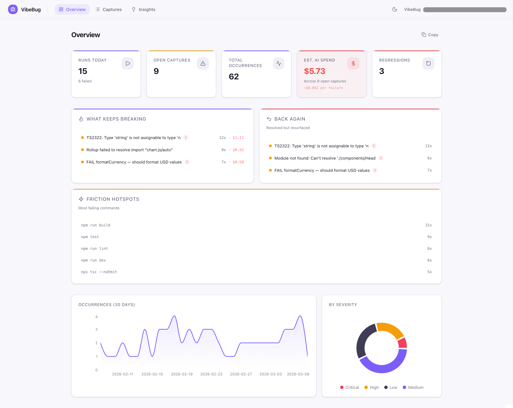

# VibeBug

**The bug tracker for vibe coding.**

Capture vibe coding failures automatically — without interrupting flow.

See what keeps breaking. Stop repeating the same fixes.

VibeBug is a local-first CLI and dashboard for builders coding fast with AI and losing track of build, test, and runtime failures. Prefix your usual commands with `vb`, and VibeBug captures failures automatically, groups recurring breakage, tracks regressions, and turns noisy terminal chaos into useful summaries.



---

## What it does

VibeBug helps you answer one question:

**What keeps breaking?**

It wraps your existing commands and gives you a lightweight failure memory for your project.

- capture build, test, and runtime failures automatically
- group recurring failures into the same capture
- detect when a previously fixed failure comes back
- track fix attempts over time
- estimate AI-debugging cost
- open a local dashboard to see recurring friction
- generate share-safe summaries for posts, docs, or team updates

---

## How it works

Run your commands like this:

```bash
vb npm run build
vb pytest
vb npx tsc
```

If the command fails, VibeBug captures the failure automatically.

Then you can:

- open the local dashboard to see what keeps breaking
- record what fixed a failure
- export or copy a share-safe summary

---

## Who it's for

VibeBug is for builders who are moving fast with AI and keep running into the same failures:

- errors disappear in terminal scrollback
- you forget what you already tried
- the same breakage comes back later
- debugging loops burn time and tokens
- there's no simple way to see recurring friction

Best fit right now:

- solo builders using AI-heavy workflows
- indie hackers shipping quickly with Cursor, Claude Code, Cline, or similar tools
- open-source tool builders and tinkerers
- anyone who wants lightweight failure tracking without setting up cloud infrastructure

---

## Why it exists

AI-assisted coding speeds up output, but it also creates a lot of repeated breakage.

Build failures, test failures, type errors, and runtime errors pile up quickly. They flash by in terminal history, fixes get repeated, and it becomes hard to learn from what already happened.

VibeBug exists to make those failures visible and useful.

Instead of losing the trail, you get a local history of:

- what fails most often
- what came back after being fixed
- which commands create the most friction
- where debugging effort and AI cost are going

---

## Why local-first matters

VibeBug is designed to be local-first.

Your failure data stays in your project under `.vibebug/` using a local SQLite database. You can inspect it, export it, and delete it whenever you want. No cloud account is required.

This makes VibeBug:

- fast to start
- easy to trust
- useful for solo workflows
- safer for local development logs

---

## Share-safe by default

VibeBug is built to make sharing safer.

Summaries and markdown exports are designed to strip or redact common sensitive details such as:

- absolute paths
- terminal formatting noise
- token-like strings
- environment variable values

That makes it easier to share a screenshot, paste a summary, or post a report without exposing raw local machine details.

You should still review anything before sharing publicly.

---

## Install

```bash
npm install -g vibebug
```

---

## Quickstart

**1) Go to your project folder**

```bash
cd my-project
```

**2) Initialize VibeBug**

```bash
vb init
```

This creates a local `.vibebug/` folder, prepares the database, and stores project config.

**3) Run your normal commands through VibeBug**

```bash
vb npm run build
vb npm test
vb npx tsc
```

If a command fails, VibeBug captures it automatically.

**4) Open the dashboard**

```bash
vb dash
```

This opens the local dashboard so you can see:

- what keeps breaking
- what came back again
- which commands fail most often
- estimated AI spend tied to failures

**5) Record what fixed something**

```bash
vb fix --last --summary "Added null check for undefined response"
```

**6) Generate a shareable summary**

```bash
vb summary
```

---

## Example summary

```
VibeBug Summary — my-project
─────────────────────────────
Runs: 14 today (5 failed) · 312 total
Open captures: 3 · Resolved: 2 · Regressions: 1
Est. AI spend: $2.43

Top recurring failures:
  1. TypeError: Cannot read properties of undefined (4x)
  2. error TS2339: Property does not exist on type (3x)
  3. Module not found: Can't resolve './Button' (2x)

Most expensive (est. AI cost):
  1. TypeError: Cannot read properties of undefined — $0.82
  2. error TS2339: Property does not exist on type — $0.64
  3. Module not found: Can't resolve './Button' — $0.38

Regressions (fixed, then broke again):
  1. TypeError: Cannot read properties of undefined (resolved → recurred)

Top failing commands:
  1. npm run build — 3x
  2. npm test — 2x
  3. npx tsc — 2x
```

---

## Core commands

```bash
vb <command>                 # wrap a command and auto-capture failures
vb init                      # initialize VibeBug in the current project
vb dash                      # open the local dashboard
vb fix --last --summary "…"  # record what fixed the latest open capture
vb list                      # list captured failures
vb summary                   # print a compact share-safe summary
vb export --format markdown  # export a share-safe markdown report
vb ignore list               # view ignored noise patterns
```

---

## Current scope

VibeBug today is:

- open-source
- local-first
- CLI-first
- single-user / project-local
- focused on capture, tracking, summaries, and visibility

VibeBug today is **not**:

- a cloud bug tracker
- a team collaboration platform
- a hosted SaaS
- an automatic fix engine

---

## FAQ

**Does VibeBug slow down my commands?**

No. VibeBug runs your command exactly as you would, then captures the output if it fails. There is no meaningful overhead.

**Does VibeBug send my logs to the cloud?**

No. VibeBug is local-first. Your data stays in your project unless you choose to export or share it.

**Is it safe to share summaries?**

VibeBug is designed to make summaries share-safe by default, but you should still review outputs before posting publicly.

**Does it work only with AI tools?**

No. VibeBug works with any command that can fail. But it is especially useful when coding with AI, because failures tend to be more repetitive and harder to keep track of.

**What kinds of failures does VibeBug track?**

Build errors, test failures, type errors, runtime crashes — anything that produces a non-zero exit code. VibeBug captures the output, groups recurring failures, and tracks regressions automatically.

**Does it replace GitHub Issues, Linear, or Jira?**

No. VibeBug is for local failure tracking and debugging visibility. It helps you understand recurring breakage during development. It is not a replacement for full team planning or project management tools.

**Is VibeBug a bug tracker?**

Yes — but it is a different kind. Traditional bug trackers are built for teams, manual reporting, and project management. VibeBug is built for solo builders who want automatic failure capture, recurring breakage visibility, and lightweight tracking without leaving the terminal.

---

## Status

VibeBug is early and actively evolving.

The current focus is making failure capture habit-forming for solo builders and AI-heavy coding workflows: low friction, useful summaries, and better visibility into recurring breakage.

---

## License

MIT
